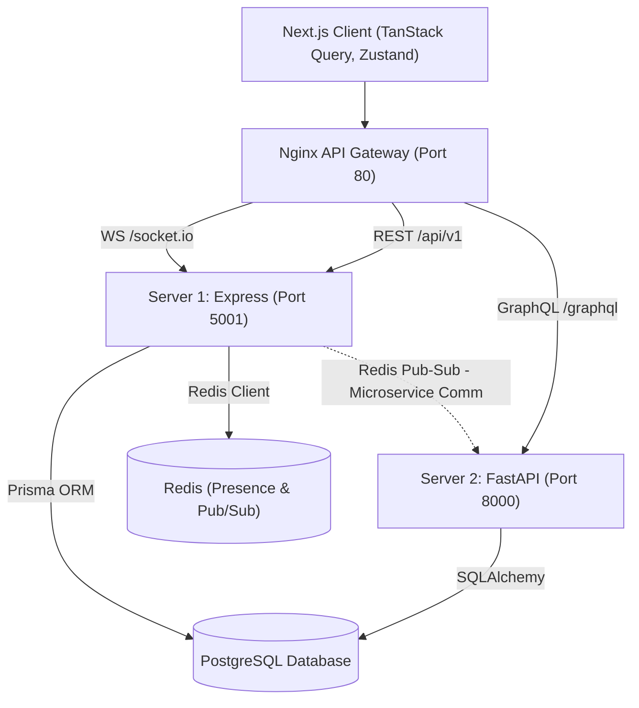

# CoSphere: Real-Time Collaborative Workspace & Analytics

CoSphere is an enterprise-grade collaborative workspace and task analytics system designed using a modern microservice architecture. It combines a real-time collaborative Kanban board, workspace live chat, and developer analytics dashboards.

---

## 🏛️ System Architecture



---

## 🛠️ Technology Stack

* **Frontend**: Next.js 14, Tailwind CSS, Zustand, TanStack Query, Recharts, Socket.io-client.
* **Gateway**: Nginx (routes HTTP, WebSockets, and GraphQL).
* **Server 1 (Core & Real-time)**: Express.js, Socket.io, Redis Client, Prisma ORM.
* **Server 2 (Analytics Microservice)**: FastAPI, Strawberry GraphQL, SQLAlchemy, Redis Subscriber.
* **Databases**: PostgreSQL (Main Data Store), Redis (Presence & Pub/Sub Message Bus).
* **Containerization**: Docker & Docker Compose.

---

## ✨ Features

1. **API Gateway Routing**: Single entrypoint for the system, solving CORS issues and optimizing secure port mappings.
2. **Interactive Kanban Board**: Dynamic board where shifting a card's status propagates to all connected team members instantly via WebSockets.
3. **Presence System**: Real-time listing of active users in the project workspace cached dynamically inside Redis.
4. **GraphQL Analytics microservice**: Python-based FastAPI server that computes statistics (cycle rates, workload distribution, priorities) from PostgreSQL and serves them via GraphQL to frontend dashboards.
5. **Microservice Event Bus**: Node backend communicates with Python microservice via Redis Pub/Sub events for live cache invalidations.

---

## 🚀 How to Run the Project

### Prerequisites
Make sure you have [Docker Desktop](https://www.docker.com/products/docker-desktop/) installed on your machine.

### Spin up the Application
Clone the repository and run:

```bash
docker compose up --build
```

Nginx will bind to **`http://localhost`** (Port 80). Open this address in your browser to view the application!

To register a user or create projects, follow the step-by-step presentation scripts in the walkthrough guide.
